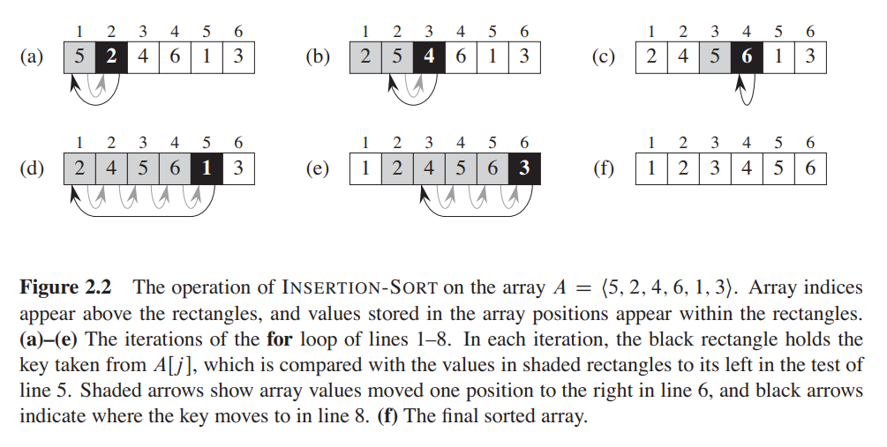

# Insertion sort
Our first algorithm, insertion sort, solves the sorting problem:
```
Input: A sequence of $n$ numbers $\langle a_1, a_2,...,a_n\rangle$.
Output: A permutation (reordering) $\langle a_1',a_2',...,a_n'\rangle$ of the input sequence such that $a_1'\leq a_2'\leq ...\leq a_n'$.
```
The numbers that we wish to sort are also known as the `keys`. Although conceptually we are sorting a sequence, the input comes to us in the form of an array with $n$
elements.

We start with insertion sort, which is an efficient algorithm for sorting a small
number of elements. Insertion sort works the way many people sort a hand of
playing cards. We start with an empty left hand and the cards face down on the
table. We then remove one card at a time from the table and insert it into the
correct position in the left hand. To find the correct position for a card, we compare
it with each of the cards already in the hand, from right to left. At all times, the cards held in the left hand are sorted, and these cards
were originally the top cards of the pile on the table.

We present our pseudocode for insertion sort as a procedure called `INSERTIONSORT`, which takes as a parameter an array $A[1..n]$ containing a sequence of
length $n$ that is to be sorted. (In the code, the number $n$ of elements in $A$ is denoted
by $A.length$.) The algorithm sorts the input numbers in place: it rearranges the
numbers within the array $A$, with at most a constant number of them stored outside
the array at any time. The input array $A$ contains the sorted output sequence when
the `INSERTION-SORT` procedure is finished.

```cpp
INSERTION-SORT(A)
    for j = 2 to A.length
        key = A[j]
        // Insert A[j]  into the sorted sequence A[1 .. j - 1].
        i = j - 1
        while i>0 and A[i] > key
            A[i+1] = A[i]
            i = i - 1
        A[i+1] = key
```

We use loop invariants to help us understand why an algorithm is correct. We
must show three things about a loop invariant:
```
Initialization: It is true prior to the first iteration of the loop.
Maintenance: If it is true before an iteration of the loop, it remains true before the
next iteration.
Termination: When the loop terminates, the invariant gives us a useful property
that helps show that the algorithm is correct.
```
Let us see how these properties hold for insertion sort.

Initialization: We start by showing that the loop invariant holds before the first
loop iteration, when $j = 2$. The subarray $A[1 : : j - 1]$, therefore, consists
of just the single element $A[1]$, which is in fact the original element in $A[1]$.
Moreover, this subarray is sorted (trivially, of course), which shows that the
loop invariant holds prior to the first iteration of the loop.

Maintenance: Next, we tackle the second property: showing that each iteration
maintains the loop invariant. Informally, the body of the for loop works by
moving $A[j - 1], A[j - 2], A[j - 3]$, and so on by one position to the right
until it finds the proper position for A[j]  (lines 4–7), at which point it inserts
the value of A[j]  (line 8). The subarray A[1..j]  then consists of the elements
originally in A[1 .. j], but in sorted order. Incrementing j for the next iteration
of the for loop then preserves the loop invariant.

Termination: Finally, we examine what happens when the loop terminates. The
condition causing the for loop to terminate is that j > A.length = n. Because
each loop iteration increases j by 1, we must have j = n + 1 at that time.
Substituting n + 1 for j in the wording of loop invariant, we have that the
subarray $A[1 .. n]$ consists of the elements originally in $A[1 .. n]$, but in sorted
order. Observing that the subarray $A[1 .. n]$ is the entire array, we conclude that
the entire array is sorted. Hence, the algorithm is correct.
## 2.1-1

> Using Figure 2.2 as a model, illustrate the operation of $\text{INSERTION-SORT}$ on the array $A = \langle 31, 41, 59, 26, 41, 58 \rangle$.

$$
\begin{aligned}
A & = \langle 31, 41, 59, 26, 41, 58 \rangle \\\\
A & = \langle 31, 41, 59, 26, 41, 58 \rangle \\\\
A & = \langle 31, 41, 59, 26, 41, 58 \rangle \\\\
A & = \langle 26, 31, 41, 59, 41, 58 \rangle \\\\
A & = \langle 26, 31, 41, 41, 59, 58 \rangle \\\\
A & = \langle 26, 31, 41, 41, 58, 59 \rangle
\end{aligned}
$$

## 2.1-2

> Rewrite the $\text{INSERTION-SORT}$ procedure to sort into nonincreasing instead of nondecreasing order.

```cpp
INSERTION-SORT(A)
    for j = 2 to A.length
        key = A[j]
        i = j - 1
        while i > 0 and A[i] < key
            A[i + 1] = A[i]
            i = i - 1
        A[i + 1] = key
```

## 2.1-3

> Consider the **_searching problem_**:
>
> **Input**: A sequence of $n$ numbers $A = \langle a_1, a_2, \ldots, a_n \rangle$ and a value $v$.
>
> **Output:** An index $i$ such that $v = A[i]$ or the special value $\text{NIL}$ if $v$ does not appear in $A$.
>
> Write pseudocode for **_linear search_**, which scans through the sequence, looking for $v$. Using a loop invariant, prove that your algorithm is correct. Make sure that your loop invariant fulfills the three necessary properties.

```cpp
LINEAR-SEARCH(A, v)
    for i = 1 to A.length
       if A[i] == v
            return i
    return NIL
```

**Loop invariant:** At the start of each iteration of the **for** loop, the subarray $A[1..i - 1]$ consists of elements that are different than $v$.

**Initialization:** Before the first loop iteration ($i = 1$), the subarray is the empty array, so the proof is trivial.

**Maintenance:** During each loop iteration, we compare $v$ with $A[i]$. If they are the same, we return $i$, which is the correct result. Otherwise, we continue to the next iteration of the loop. At the end of each loop iteration, we know the subarray $A[1..i]$ does not contain $v$, so the loop invariant holds true. Incrementing $i$ for the next iteration of the **for** loop then preserves the loop invariant.

**Termination:** The loop terminates when $i > A.length = n$. Since $i$ increases by $1$, we must have $i = n + 1$ at that time. Substituting $n + 1$, for $i$ in the wording of the loop invariant, we have that the subarray $A[1..n]$ consists of elements that are different than $v$. Thus, we return $\text{NIL}$. Observing that $A[1..n]$, we conclude that the entire array does not have any element equal to $v$. Hence the algorithm is correct.

## 2.1-4

> Consider the problem of adding two $n$-bit binary integers, stored in two $n$-element arrays $A$ and $B$. The sum of the two integers should be stored in binary form in an $(n + 1)$-element array $C$. State the problem formally and write pseudocode for adding the two integers.

**Input:** An array of booleans $A = \langle a_1, a_2, \ldots, a_n \rangle$ and an array of booleans $B = \langle b_1, b_2, \ldots, b_n \rangle$, each representing an integer stored in binary format (each digit is a number, either $0$ or $1$, least-significant digit first) and each of length $n$.

**Output:** An array $C = \langle c_1, c_2, \ldots, c_{n + 1} \rangle$ such that $C' = A' + B'$ where $A'$, $B'$ and $C'$ are the integers, represented by $A$, $B$ and $C$.

```cpp
ADD-BINARY(A, B)
    C = new integer[A.length + 1]
    carry = 0
    for i = 1 to A.length
        C[i] = (A[i] + B[i] + carry) % 2  // remainder
        carry = (A[i] + B[i] + carry) / 2 // quotient
    C[i + 1] = carry
    return C
```
